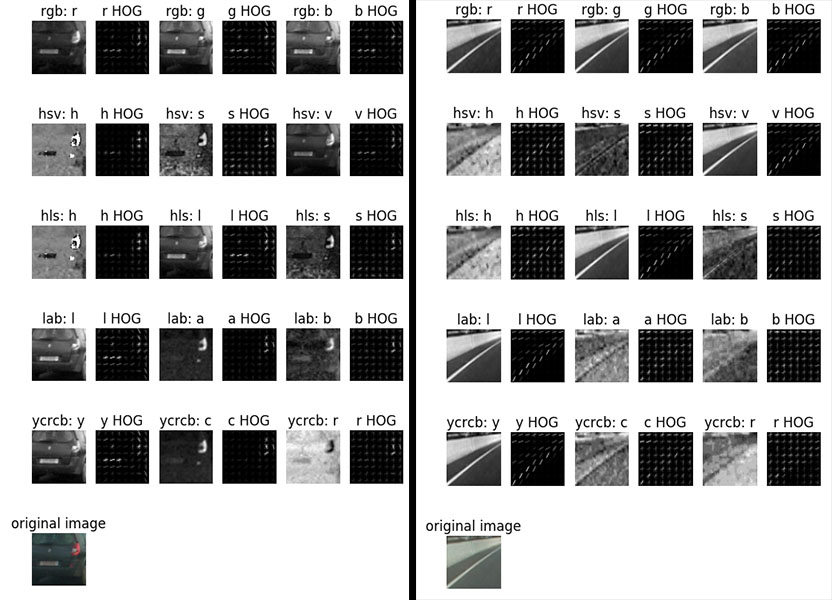
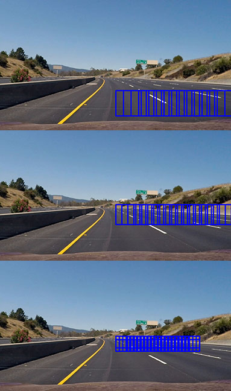
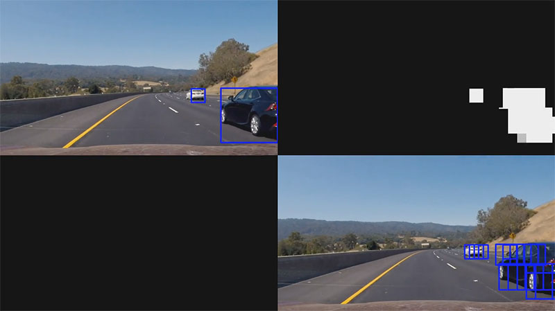

#**Vehicle Detecion**

Vehicle detection from a monocular RGB video input using two different approaches - Supervised Learning (Support Vector Machine) and Deep Learning. 

The Deep Learning implementation is the more successful of the two since it is considerably faster.

Quick links to final results:

* [Deep Learning Solution w/ lane detection](https://youtu.be/IHhLpB5MNTQ) | [w/ additional data](https://youtu.be/DTaLG2DSjyU)
* [SVM solution](https://youtu.be/DOCzH0R3ERc)


---
##Project Files

The initial data exploration and extraction is carried out in the notebook `data_exploration.ipynb`.

The labeled data came from a combination of the GTI vehicle image database and the KITTI vision benchmark suite. Training data for the neural network as well as additional negative examples for the SVM classification where extracted from the [Udacity labeled dataset](https://github.com/udacity/self-driving-car/tree/master/annotations). `data_exploration.ipynb` also contains data extraction for the Udacity set.  

The final pipeline is implemented in python. Included in the project are:
- `vehicleDetect.py`  
Vehicle Detection using a previously trained classifier. 
- `vehicleDetect_classify.py`  
Handles training of the classifiers
- `vehicleDetectUtil.py`  
Contains common functions needed to run the vehicle detection and classification
- `vehicleDetect_svmVar.py`  
Settings for the Support Vector Machine input features

---
##Usage

For deep learning or support vector machine method, run one of the following:  
```
python vehicleDetect.py cnn fileName   
python vehicleDetect.py svm fileName  
```


For training, you have to set variables at the top of `vehicleDetect_classify.py` and run:  
```
python vehicleDetect_classify.py fileName
```

---
##Classifiers

###Support Vector Machine
The Support Vector Machine used in this is scikit-learn's LinearSVC. It runs on modest hardware at about 1.5 seconds/frame and has lots of room for additional performance gains. It was trained on subsets of the GTI and KITTI, as well as manually extracted negative examples from the Udacity set. The latter helped some in reducing false positives in areas with a lot of information (trees and complex shadows). It is trained in lines 90-143 of `vehicleDetect_classify.py` and then pickled for reuse. It was trained on 8,792 car and 10,291 non-car images.  

#####Training
I am using all channels, as well as histogram binning of the YCrCb colorspace as features. Initial data visualization pointed to YCrCb as a color space with useful and different information in all channels. After many trials and with pointers from the Q&A for spatial and histogram binning parameters, I arrived at the settings in `vehicleDetect_svmVar.py`. For the HOG features, I am using 9 orientation bins, 8 pixels per cell and 2 cells per block - I started out with these fairly standard settings and none of my tests showed noticeably improved performance with different values. Using a small amount of color (16x16) and histogram features (16 bins) helped false positive detection in particular.

*Colorspace exploration (vehicle / non-vehicle)*  


HOG features look very useful across all three channels and are extracted in lines 140-150 in `vehicleDetectUtil.py`. The entire feature extraction is managed in lines 155-222.

The feature vectors are normalized via scikit-learn's StandardScaler (lines 111-113 in `vehicleDetect_classify.py`).

The final feature vector size is 3000. It's original size of 6108 was reduced via scikit-learn's principal component analysis (117-119 in `vehicleDetectUtil.py`).

###Deep Learning
I am using a fairly slim convolutional neural network that has previously performed well on CIFAR10. It runs at **8fps** on modest hardware. Since all I need here is a binary decision on small images, I expected it to perform reasonably well. It is implemented in Keras in lines 224-252 of `vehicleDetectUtil.py`.

#####Training
I extended the training data used for the SVM with bounding box data extracted from the Udacity set. Total training set size is 118,493 64x64 images, evenly split between car and non-car samples. Data augmentation (lines 34-58 in `vehicleDetect_classify.py`) further strengthens the training set - it includes mirroring, random translation and random brightness. The model is trained and saved in lines 203-217 of `vehicleDetect_classify.py`.  

The final model was trained for 100 epochs. It started to overfit at higher epochs, resulting in many false-positives in the video.

---
##Vehicle Labeling
Both SVM and CNN methods use the same approach for finding and labeling vehicles. Sliding windows are used to feed images to the classifier. A heat map is generated over several frames, then gets filtered and labelled.

###Sliding Window Search
To start, I am limiting my search to the right half of the frame, compensating for the lack of data about the road to focus attention properly (my lane finding code was eventually merged with this vehicle detection, but they do not communicate yet). This covers detections in my video and allowed for faster iterations.  

I perform a simple sliding window search to extract cropped images for classification. For efficiency, the window locations are computed once on the first frame and then reused (lines 184-199 in `vehicleDetect.py`). I use different sizes of windows at different locations in the image. Per frame, the saved windows are used to extract cropped images via `vehicleDetectUtil.get_window_imgs()` (line 200 in `vehicleDetect.py`) and then sent to the classifier all at once.  

The SVM method uses 457 windows (overlap: 0.8), while the CNN detection only uses 76 (overlap: 0.7).

*Sliding windows (CNN). Larger window sizes closer to the bottom and 0.7 overlap. 76 total.*  


###Heat Map
For each frame, every bounding box that is detected as part of a vehicle by **two** or more bounding boxes adds "heat" to a map. The result is smoothed over eight frames, further thresholded and then fed into scipy's label function to get a single bounding box for each distinct "island" in the heat map (lines 206-221 in `vehicleDetect.py`).

###False Positive Suppression
I am doing two things to prevent false positives:  
- As discussed above, the heat map is thresholded twice
- Additionally, I am ignoring bounding boxes with unreasonable aspect ratios that come out of the label function (lines 225-230 in `vehicleDetect.py`)

###Bounding Box Smoothing
I implemented a Car class that keeps track of positions over time (lines 51-87 in `vehicleDetect.py`). Bounding box coordinates are smoothed over six frames. Additionally, I reuse the previous location if the classifier does not detect the car for up to two frames.

*Example frame with labeled image (top left), heat map (top right) and unfiltered sliding-windows detection (bottom right)*  


---
##Video Results

* [Deep Learning Solution w/ lane detection](https://youtu.be/IHhLpB5MNTQ) | [w/ additional data](https://youtu.be/DTaLG2DSjyU)
* [SVM solution](https://youtu.be/DOCzH0R3ERc)

---
##Discussion  
- Setting up a neural network and training it from scratch for this turned out to be a very straight-forward process that yielded great results fairly quickly.
- The SVM method should be able to run a lot faster. In order to speed it up, I started scaling the image instead of scaling the individual crops - also to set up extracting HOG features from only a single image. In hindsight, this turned out fairly messy and slowed down my iteration time of tweaking the sliding window boundaries due to the unintuitive scaled image sizes. It started to be too time-consuming and I left it where it is right now in order to focus on the deep learning solution.
- Keeping track of individual cars in screen space was impractical to do with just scipy's label method. It does not consistently apply the same label to similar islands in the heat map, so I had to put additional checks in my car class to reset it in case labels flip. A custom label function that gets to draw on more information about the existing car instances and can make reasonable assumptions about how traffic moves should perform well here.
- Neither method fits a tight bounding box around the cars at all times. In order to increase accuracy and speed, I would look into making it a two-step process: A quick initial detection of candidate areas, followed by a very localized sliding-window search. Previously detected cars could be re-used on each frame for additional speedup.
- A search on the entire image using a large neural net would be very interesting to look into more. I tried a pre-trained YOLO-tiny with some success, and it runs very fast (20fps+).
